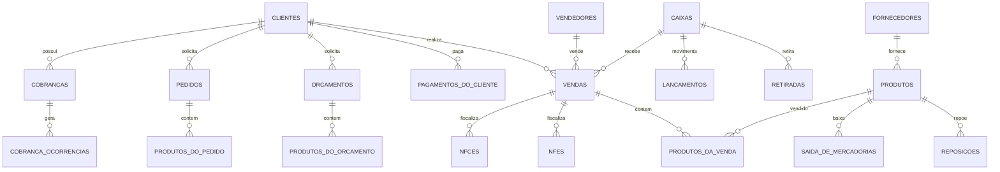

# Auditoria 01 - Inventario

Data da auditoria: 2026-07-12
Modo aplicado: MODO 1 - AUDITORIA
Escopo: vendas, orcamentos, pedidos, financeiro, caixa, permissoes, fiscal, banco, testes e operacao.

## Ambiente identificado

- PHP CLI: 8.2.12, executado via `C:\xampp\php\php.exe`.
- CodeIgniter: 4.7.2, identificado por `php spark`.
- Banco configurado: MySQL/MariaDB via driver `MySQLi`.
- Configuracao de banco: `app/Config/Database.php`; credenciais nao foram registradas neste documento.
- Ambiente local: `C:\xampp\htdocs\zaventus`.
- Composer: `composer.json` existe, mas `composer.lock` e `vendor/` nao existem no workspace.
- PHPUnit/PHPStan/Rector/php-cs-fixer: scripts definidos no `composer.json`, mas binarios nao instalados localmente.
- Deploy: `.github/workflows/deploy.yml` ainda parece workflow herdado do CodeIgniter, publicando em repos `codeigniter4/framework` e `codeigniter4/appstarter`, nao em um deploy especifico do produto.
- `.env`: arquivo local ignorado por Git; contem chave de criptografia configurada. O valor nao foi copiado para esta auditoria.

## Estrutura de diretorios

- `app/Controllers`: 38 arquivos.
- `app/Models`: 56 arquivos.
- `app/Entities`: 0 arquivos.
- `app/Filters`: 3 arquivos, sendo 2 PHP funcionais (`AuthGuard`, `SystemSettings`).
- `app/Database/Migrations`: 73 migrations.
- `app/Database/Seeds`: 2 seeds.
- `app/Views`: 118 arquivos.
- `app/Libraries`: 16 bibliotecas de dominio/apoio.
- `app/Services`: 0 arquivos.
- `app/Commands`: nao foram encontrados comandos/jobs customizados.
- `public`: assets, tema AdminLTE, arquivos publicos.
- `writable/backup_mysql`: contem backup SQL local.

## Dependencias declaradas

`composer.json` declara:

- PHP `^8.2`.
- `laminas/laminas-escaper`.
- `psr/log`.
- Dev: PHPUnit, PHPStan, Rector, php-cs-fixer, faker, vfsstream, Kint.

Observacao: README cita bibliotecas `sped-nfe` e `mysqldump-php`. Ha codigo third-party de mysqldump em `app/ThirdParty`; sem `composer.lock`, nao foi possivel validar versoes instaladas.

## Frontend identificado

- AdminLTE / Bootstrap.
- jQuery.
- Select2.
- SweetAlert2.
- DataTables.
- Chart.js.
- CSS customizado em `public/assets/css/style.css`.

## Autenticacao

- Controller: `app/Controllers/Login.php`.
- Login por sessao.
- Senhas novas usam `password_hash(..., PASSWORD_BCRYPT)` em `Login.php:186`.
- Login verifica hash por `password_verify` em `Login.php:316-317`.
- Hash legado em texto puro ainda e aceito por compatibilidade em `Login.php:320`.
- Sessao e regenerada apos login em `Login.php:243`.
- Nao foi identificado rate limiting ou bloqueio de forca bruta.

## Autorizacao

- Filtro global: `app/Filters/AuthGuard.php`.
- Permissoes por modulo/funcionalidade em JSON na sessao.
- Mapa de controller para permissao em `AuthGuard.php:16-43`.
- Verificacao por registro/propriedade do objeto nao foi evidenciada.
- Controllers consultam objetos diretamente por ID em varios fluxos, por exemplo `Vendas.php:163`, `Clientes.php:160`, `Orcamentos.php:183`.

## Rotas e filtros

- `app/Config/Routes.php:23` habilita `$routes->setAutoRoute(true)`.
- `php spark routes` retornou 324 rotas automaticas e 7 rotas GET explicitas.
- `app/Config/Filters.php:76-86`: `systemsettings`, `invalidchars` e `authguard` globais; `secureheaders` no after.
- `app/Config/Filters.php:102-107`: CSRF aplicado a POST, PUT, PATCH e DELETE.
- `AuthGuard.php:154-179`: algumas acoes sensiveis exigem POST por lista/prefixo.

## Controllers principais

- `Caixas.php`: caixa, abertura, fechamento, reabertura.
- `Cobrancas.php`: cobrancas independentes e alertas.
- `Clientes.php`: cadastro, historico, imagem, exclusao.
- `ContasPagar.php` e `ContasReceber.php`: contas simples.
- `ControleFiscal.php`, `NFe.php`, `Pdv.php`: fiscal NFe/NFCe.
- `Orcamentos.php`, `Pedidos.php`, `Vendas.php`, `Pdv.php`, `VendaRapida.php`: fluxo comercial.
- `Relatorios.php`, `RelatorioDRE.php`: relatorios.
- Controllers grandes: `OrdensDeServicos.php` (>1200 linhas), `Pdv.php` (>1000), `Relatorios.php`, `NFe.php`, `Configs.php`, `Produtos.php`.

## Models principais

Foram encontrados 55 models com `allowedFields`; nenhum model analisado declarou `validationRules`.

Models financeiros/transacionais relevantes:

- `CaixaModel`
- `ContaPagarModel`
- `ContaReceberModel`
- `LancamentoModel`
- `RetiradaModel`
- `DespesaModel`
- `PagamentoDoClienteModel`
- `VendaModel`
- `ProdutoDaVendaModel`
- `OrcamentoModel`
- `ProdutoDoOrcamentoModel`
- `PedidoModel`
- `ProdutoDoPedidoModel`
- `CobrancaModel`
- `CobrancaOcorrenciaModel`
- `NFeModel`
- `NFCeModel`
- `DocumentoFiscalEventoModel`

Base comum: `app/Models/PadraoModel.php`, com callbacks para normalizacao de campos.

## Libraries customizadas

- `Moeda`: normalizacao monetaria.
- `CobrancaRecorrente`: sincronizacao de parcelas/alertas de cobranca.
- `FaturamentoNegocio` e `DashboardNegocio`: agregacoes gerenciais.
- `SefazFiscalService`: integracao fiscal/SEFAZ.
- `CredencialIntegracaoPagamento`: criptografia de credenciais de pagamento.
- `ImagemCadastro`: tratamento de imagens de cadastro.
- `CampoPadrao`, `ContatoPadrao`, `EnderecoPadrao`, `TipoNegocio`, `ProvedoresPagamento`.

## Banco e migrations

- 56 tabelas criadas por migrations.
- 47 definicoes de foreign key encontradas nas migrations.
- Backup SQL local lista 59 `CREATE TABLE`, incluindo `migrations`.
- Migration `2026-06-09-000005_padroniza_valores_monetarios.php` padroniza varias colunas monetarias para `DECIMAL(15,2)` no `up()`, mas o `down()` volta para `DOUBLE`.
- Migrations antigas criam valores financeiros como `DOUBLE`, por exemplo `vendas` em `2020-03-05-163025_vendas.php:20-33`, `orcamentos` em `2020-03-12-143912_orcamentos.php:25-38`, `contas_a_receber` em `2020-03-05-162749_contas_a_receber.php:34-35`.

## Entidades principais do banco

## Testes

- Existem testes do framework em `tests/system`.
- Nao foram identificados testes especificos de regras do produto.
- `vendor/bin/phpunit` nao existe localmente.
- `phpunit.xml.dist` existe.

## Operacao e backup

- README orienta servidor apontando para `public/`.
- Backup via tela de configuracoes existe no escopo funcional.
- Arquivo local `writable/backup_mysql/BACKUP_DATABASE_SISTEMA.sql` existe e esta modificado no working tree.
- Nao foi identificado procedimento automatizado de restore testado.

## Limitacoes do levantamento

- Nao houve conexao com banco real nesta auditoria.
- Nao foram executadas migrations.
- Nao foram lidos dados de producao.
- Nao foi validada versao real de MySQL/MariaDB em servidor.
- Sem `vendor/`, nao foi possivel executar PHPUnit, PHPStan, Rector ou auditoria de dependencias.
- A auditoria fiscal nao validou comunicacao real com SEFAZ.
